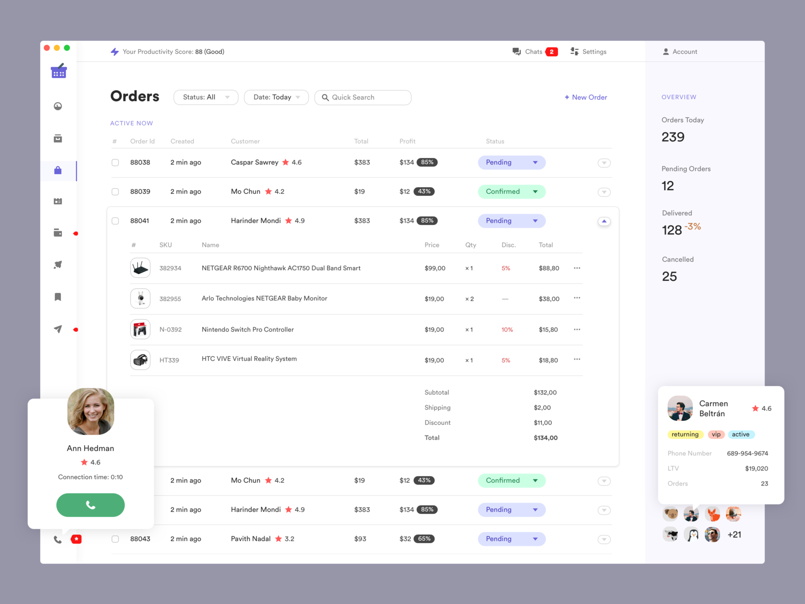
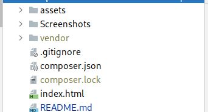
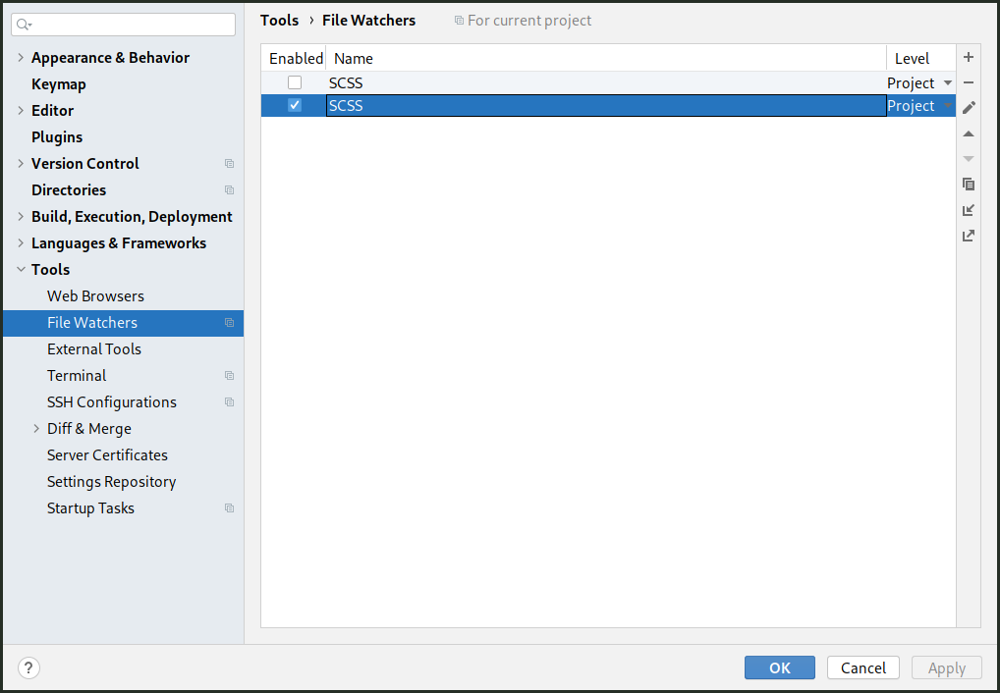
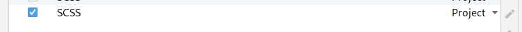
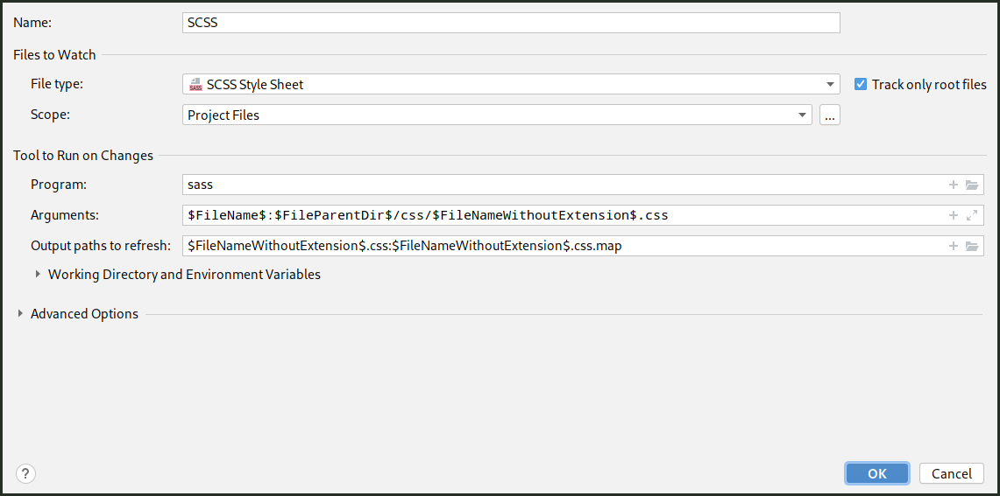

### TEMPLATE HTML CSS [EN COURS]

Le template est en cours donc tous les fonctionnalités ne sont pas encore implémenté .



## Fonctionnalités qui seront disponible sur la page

- menu vertical et horizontal
- pagination
- fenêtre Modal

# Reste à faire 

- refactoring du code pour mieux l'organiser
- affichage des modals
- modifier le menu et les sidebar pour les rendre plus attractifs comme sur l'image

## Structure du projet



Le dossier assets contient les images , les fichiers css3 , scss
et les fonts (police d'écriture sur la page ).

Le dossier vendor apparait à la racine du projet une fois les dépendances installé .

### Outils et frameworks utilisés


<table>
  <tbody>
    <tr>
      <td align="center" valign="middle">
        <a href="https://v5.getbootstrap.com/" target="_blank">
          
        </a>
      </td>
      <td align="center" valign="middle">
        <a href="http://smacss.com/" target="_blank">
          
        </a>
      </td>
      <td align="center" valign="middle">
        <a href="https://www.jetbrains.com/fr-fr/" target="_blank">
          
        </a>
      </td>
      <td align="center" valign="middle">
        <a href="https://getcomposer.org" target="_blank">
          
        </a>
      </td>
      <td align="center" valign="middle">
              <a href="https://fontawesome.com/" target="_blank">
                
              </a>
       </td>
    </tr>
  </tbody>
 </table>
 
 ## Comment installer sass et composer
 
 ### sass 
 Sur windows veuillez avant tout installer <b> nodejs </b> , puis ensuite vous pourrez bénéficier de la commande npm . si vous avez déjà npm :
 
  ```bash
  > npm install -g sass
  ```
Cette commande installera le package sass globalements sur votre système .

Pour vérifier que sass est bien présent , essayer la commande :

  ```bash
  > sass -v
  ```

 
 ## Comment apporter ses modifications sur le projet
 
 - Avoir installer git , composer , sass 
 
 - S'assurer que composer et sass sont enregistrés dans la variable path du système d'exploitation
 
 - **Clôner** le projet git et se deplacer dans le dosser racine du projet
 

 - Installer les dépendances avec le gestionnaire de paquet **composer** 
 
 ```bash
 > composer install
 ```
 
Si vous utiliser un <b>IDE de jetbrains</b> , il y a une fonctionnalité appélé le fileWatcher qui permet de surveiller les modifications apportés
aux fichiers sass ou ... 
Donc en premier vérifier que le <b>fileWatcher</b> est bien activé dans la liste des Plugins .
Ensuite Ajouter la configuration suivante en créant votre fileWatcher :

[Si vous ne voyez pas FileWatcher ici n'oublier pas de regarder dans la liste des Plugins pour vérifier qu'il est bien installé ]


[ Il est activé chez moi ]



La configuration 



Une fois finie , Lorsque vous modifier un fichier scss , immédiatement une compilation s'en suit pour générer un fichier style.css dans le dossier css .

### Contributeurs

- Bamba Mohamed
